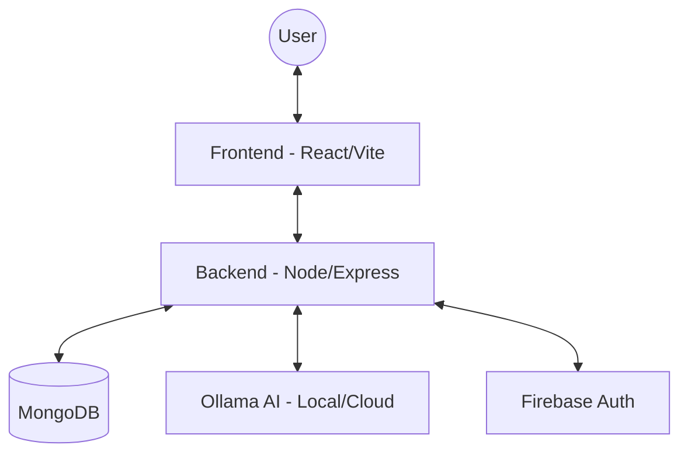

# 🎓 Cogniva - Agentic AI Learning Platform

> **Revolutionizing Education with Agentic AI, Dynamic Skill Trees, and Personalized Learning Paths.**

[](https://github.com/Manideep667320/Cogniva)
[](https://github.com/Manideep667320/Cogniva)

---

## 📋 Overview

Cogniva is a next-generation AI learning platform designed to provide students with a personalized, visual, and interactive educational experience. By combining **Agentic AI** with **Dynamic Skill Trees**, Cogniva helps learners navigate complex subjects through structured paths while receiving real-time guidance from a private AI tutor.

### 🌟 Key Features

- 🤖 **Agentic AI Tutor**: A sophisticated multi-stage agent (Diagnose → Plan → Teach → Evaluate) that adapts to your learning pace.
- 🌳 **Dynamic Skill Trees**: Visualized learning paths that show progress and unlockable topics using React Flow.
- 🎓 **Multi-Role Support**: 
  - **Students**: Track progress, chat with AI, and complete courses.
  - **Faculty**: Create and manage high-fidelity courses with rich content.
- 📤 **Intelligent RAG Pipeline**: Upload documents to provide your AI tutor with specific domain knowledge.
- 👤 **Personalized Profiles**: AI-driven learning style analysis and difficulty adjustment.
- 📡 **Real-time Interaction**: Streaming SSE (Server-Sent Events) for instant AI feedback.

---

## 🏗️ Architecture

Cogniva follows a decoupled, service-oriented architecture designed for scalability and local-first AI privacy.



### 🛠️ Tech Stack

| Component | Technology |
|-----------|-------------|
| **Frontend** | React 19, TypeScript, Vite, Tailwind CSS 4, Framer Motion, shadcn/ui |
| **Backend** | Node.js, Express.js, MongoDB (Mongoose), JWT |
| **AI/LLM** | Ollama (Local LLM), SSE Streaming, RAG Pipeline |
| **Authentication** | Firebase Auth / JWT Integration |
| **Styling** | Modern Aesthetics (Glassmorphism, Dark Mode) |

---

## 🚀 Getting Started

### Prerequisites

- **Node.js 18+**
- **MongoDB** (Atlas or Local)
- **Ollama** (for AI features)
- **Firebase Project** (for authentication)

### Installation

1. **Clone the repository**:
   ```bash
   git clone https://github.com/Manideep667320/Cogniva.git
   cd Cogniva
   ```

2. **Setup Backend**:
   ```bash
   cd backend
   npm install
   cp .env.example .env # Update with your credentials
   npm run dev
   ```

3. **Setup Frontend**:
   ```bash
   cd ../frontend
   npm install
   # Create .env and set VITE_API_URL=http://localhost:8000
   npm run dev
   ```

---

## 🔐 Production-Ready Checklist

To deploy Cogniva in a production environment, ensure the following configurations are met:

### 1. Security
- [ ] **HTTPS/SSL**: Use a reverse proxy (Nginx/Caddy) for SSL termination.
- [ ] **Environment Secrets**: Use a secrets manager (AWS Secrets Manager / GCP Secret Manager).
- [ ] **JWT Hardening**: Change the default `JWT_SECRET` to a cryptographically strong key.
- [ ] **CORS Settings**: Restrict `CORS_ORIGIN` to your production domain.
- [ ] **Helmet.js**: Enable security headers in the Express backend.

### 2. Scalability
- [ ] **Database**: Migrate from local MongoDB to a managed service like **MongoDB Atlas**.
- [ ] **AI Backend**: For high traffic, consider hosting Ollama on a GPU-optimized instance or using a cloud provider (OpenAI/Anthropic).
- [ ] **Static Assets**: Serve the `frontend/dist` via a CDN (CloudFront/Cloudflare).

### 3. Monitoring
- [ ] **Logging**: Implement a logging service like **Winston** or **Pino**.
- [ ] **Error Tracking**: Integrate **Sentry** for real-time frontend and backend error monitoring.
- [ ] **Health Checks**: Monitor the `/health` endpoint for uptime status.

---

## 📂 Project Structure

```
Cogniva/
├── frontend/         # React application (Vite-based)
│   ├── src/          # Source code
│   └── public/       # Static assets
├── backend/          # Node.js API service
│   ├── controllers/  # Business logic
│   ├── models/       # Database schemas
│   └── services/     # AI & External integrations
├── uploads/          # Local storage for RAG pipeline (mapped in production)
└── README.md         # This entry point
```

---

## 📝 License

Distributed under the MIT License. See `LICENSE` for more information.

## 👨‍💻 Contributors

- **Manideep Masna** - Lead Developer & Architect

---

**Cogniva: Learn Smarter, Not Harder.** 🎓✨
