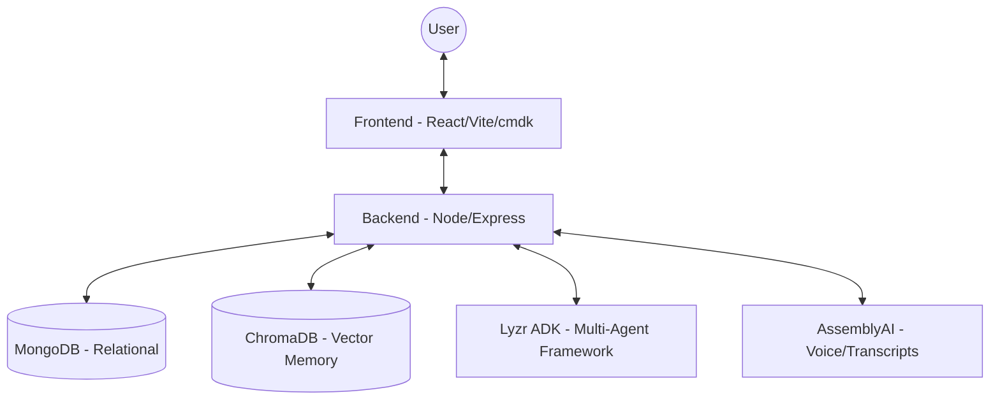

# 🎓 Cogniva - Persistent Academic Intelligence Layer

> **Revolutionizing Education with Multi-Agent AI, Semantic Memory, Spaced Repetition, and Autonomous Learning Paths.**

[](https://github.com/Manideep667320/Cogniva)
[](https://github.com/Manideep667320/Cogniva)

---

## 📋 Overview

Cogniva has evolved beyond a simple AI tutor into a **Persistent Academic Intelligence Layer**. By combining **Multi-Agent Orchestration**, **Global Semantic Memory**, and **Adaptive Spaced Repetition**, Cogniva autonomously maps out and optimizes the student's entire educational journey.

### 🌟 Key Features

- 🧠 **Multi-Agent Orchestration (Lyzr ADK)**: A decentralized system of specialized agents (Tutor, Planner, Flashcard, Memory, and Evaluator) communicating to optimize learning.
- 🗣️ **Voice-First Interface (AssemblyAI)**: Hands-free learning with real-time lecture transcription, semantic segmentation, and voice-command intent routing.
- 🔍 **Global Semantic Search**: A universal `Cmd+K` command palette powered by ChromaDB, enabling semantic queries across your entire academic history (lectures, notes, chats).
- 📈 **Adaptive Spaced Repetition**: Integrated `ts-fsrs` algorithm paired with LLM-generated flashcards to dynamically target and eliminate conceptual weaknesses.
- 📊 **Comprehensive Academic Analytics**: Beautiful, interactive time-series visualizations (via Recharts) tracking cognitive load, learning velocity, and revision consistency.
- 🗓️ **Autonomous Study Planning**: An intelligent background agent that continuously analyzes your weak spots to mathematically construct an optimized 7-day study calendar.
- 🌳 **Dynamic Skill Trees**: Visualized learning paths that show progress and unlockable topics using React Flow.

### ⚡ Advanced Classroom & Ingestion Features

- 👥 **Cooperative Study Rooms & Shared Whiteboard**: Real-time room sandboxes (`/rooms`) featuring collaborative live chats, PDF document sharing, and an interactive shared canvas whiteboard powered by `tldraw`.
- 📝 **AI-Powered Assignment Evaluator**: Automatic assignment grading. Students receive detailed AI scoring, highlighted strengths, and improvement suggestions, with a back-end interface for faculty reviews and score overrides.
- 🎓 **Faculty Student Insights Dashboard**: A dedicated analytics dashboard for instructors (`/insights`) summarizing class-wide topic weaknesses, course difficulty levels, and student enrollment metrics.
- 🔗 **Multi-Source Knowledge Ingestion & Lecture URL Capture**: Ingests video links, YouTube lectures, Loom recordings, and web articles directly into the vector database. Utilizes AssemblyAI (for direct media streams) or Gemini summarization fallbacks.
- 🔀 **Active Planner Routing & Task Elimination**: The study calendar routes users directly to target learning tasks (e.g. assignments, tutors). Completing tasks instantly updates the background agent and deletes the scheduled items.
- 🔐 **Isolated Multi-Session Sandboxing**: Token management isolated to `sessionStorage` to allow multiple concurrent user logins/tabs in a single browser window.

---

## 🚀 Recent Updates & Advanced Integrations (May 2026)

Cogniva has been updated with several key features to support richer content ingestion, smoother offline experiences, and optimized hardware rendering:

*   **URL Ingestion (Faculty Dashboard):** We extended the **Knowledge Base** to support public URLs, YouTube videos, and Loom recordings. The backend scraper downloads the text, uses Gemini to synthesize structured study guides, and embeds them into ChromaDB.
*   **AssemblyAI URL Capture:** Faculty can submit lecture URLs (like Loom or YouTube links) directly to the **Lecture Capture** service. Uses AssemblyAI URL transcription or Gemini summaries as fallbacks, generating flashcards and semantic memory segments.
*   **Offline SPA Router Fallback:** Upgraded `/sw.js` (Service Worker) fetch handlers to gracefully intercept network failures or offline routing requests (e.g. direct entry or refreshes on `/rooms/*`), serving cached `/index.html` to keep client-side navigation functional.
*   **WebGL Performance Optimization:** Resolved WebGL context lost warnings by converting dynamic prop triggers (like hover status, color transitions, or hue shifts) into React refs. The WebGL context in `Orb.tsx` is now created once on mount and destroyed once on unmount.

---

## 🏗️ Architecture

Cogniva follows a highly decoupled, service-oriented architecture designed for scalability, deep memory retention, and autonomous AI processing.


```mermaid
graph TD
    User((User)) <--> Frontend[Frontend - React/Vite/cmdk]
    Frontend <--> Backend[Backend - Node/Express]
    Backend <--> MongoDB[(MongoDB - Relational)]
    Backend <--> ChromaDB[(ChromaDB - Vector Memory)]
    Backend <--> Lyzr[Lyzr ADK - Multi-Agent Framework]
    Backend <--> AAI[AssemblyAI - Voice/Transcripts]
```

### 🛠️ Tech Stack

| Component | Technology |
|-----------|-------------|
| **Frontend** | React 19, TypeScript, Vite, Tailwind CSS 4, Recharts, cmdk, shadcn/ui |
| **Backend** | Node.js, Express.js, MongoDB (Mongoose) |
| **AI Agents** | Lyzr ADK, Gemini/OpenAI (LLM Core) |
| **Vector DB** | MongoDB Atlas Vector Search (Semantic Memory, RAG) |
| **Voice & Audio**| AssemblyAI, Web Audio API (MediaRecorder) |
| **Algorithms** | FSRS (Free Spaced Repetition Scheduler) |

---

## 🚀 Getting Started

### Prerequisites

- **Node.js 18+**
- **MongoDB** (Atlas or Local)
- **ChromaDB** (Running locally via Docker or managed)
- **AssemblyAI API Key** (for Voice features)
- **Gemini/OpenAI API Key** (for Lyzr Agents)

### Installation

1. **Clone the repository**:
   ```bash
   git clone https://github.com/Manideep667320/Cogniva.git
   cd Cogniva
   ```

2. **Environment Variables**:
   Create a `.env` file in the `backend/` directory based on `.env.example`:
   ```env
   PORT=8000
   MONGO_URI=mongodb://localhost:27017/cogniva
   JWT_SECRET=your_secret
   GEMINI_API_KEY=your_gemini_key
   ASSEMBLYAI_API_KEY=your_aai_key
   CHROMA_HOST=localhost
   CHROMA_PORT=8000
   ```

3. **Install Dependencies (Root Workspace)**:
   We've included a handy script to install dependencies across the entire monorepo simultaneously:
   ```bash
   npm run install:all
   ```

4. **Run the Full Stack Locally**:
   Using `concurrently`, you can boot up both the Vite frontend and Nodemon backend with a single command from the root directory:
   ```bash
   npm run dev
   ```

---

## 🔐 Production-Ready Checklist

To deploy Cogniva in a production environment, ensure the following configurations are met:

### 1. Security
- [ ] **HTTPS/SSL**: Use a reverse proxy (Nginx/Caddy) for SSL termination.
- [ ] **Environment Secrets**: Use a secrets manager (AWS/GCP).
- [ ] **JWT Hardening**: Change the default `JWT_SECRET` to a cryptographically strong key.

### 2. Infrastructure & Scalability
- [ ] **Database Migration**: Migrate to managed **MongoDB Atlas**.
- [ ] **Vector Database**: Host ChromaDB persistently (e.g., AWS EC2 with volume mounts) or use a managed vector DB (Pinecone/Weaviate).
- [ ] **Agentic Workers**: For heavy Lyzr agent workloads, consider extracting agent processing into background worker queues (BullMQ/Redis).
- [ ] **Static Assets**: Serve the `frontend/dist` via a CDN (CloudFront/Cloudflare).

---

## 📂 Project Structure

```text
Cogniva/
├── frontend/         # React application (Vite-based)
│   ├── src/          
│   │   ├── components/ # GlobalSearch, VoiceAvatar, UI components
│   │   ├── pages/      # Dashboards, FlashcardStudio, StudyCalendar
│   │   └── ...
├── backend/          # Node.js API service
│   ├── agents/       # Lyzr ADK Agents (Tutor, Planner, Schedule, Flashcard)
│   ├── controllers/  # Business logic
│   ├── models/       # MongoDB schemas (StudyPlan, ReviewLog, SemanticMemory)
│   ├── routes/       # Express routing
│   └── services/     # ChromaDB, FSRS, AssemblyAI integrations
├── package.json      # Root workspace (concurrently scripts)
└── README.md         # This entry point
```

---

## 📝 License

Distributed under the MIT License. See `LICENSE` for more information.

## 👨‍💻 Contributors

- **Manideep Masna** - Lead Developer & Architect

---

**Cogniva: Learn Smarter, Not Harder.** 🎓✨
